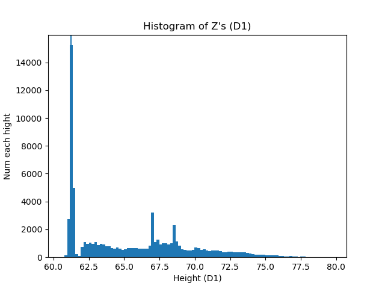
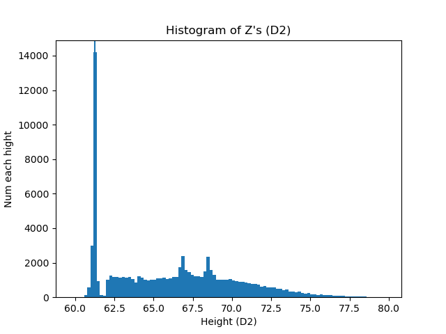

## Task 1 – Ground Level Estimation

### Dataset 1
Ground level: 61.24968500000003

---

### Dataset 2
Ground level: 61.26545

The estimated ground level for each dataset are quite similar, indicating that the scans are consistent with the real world.
